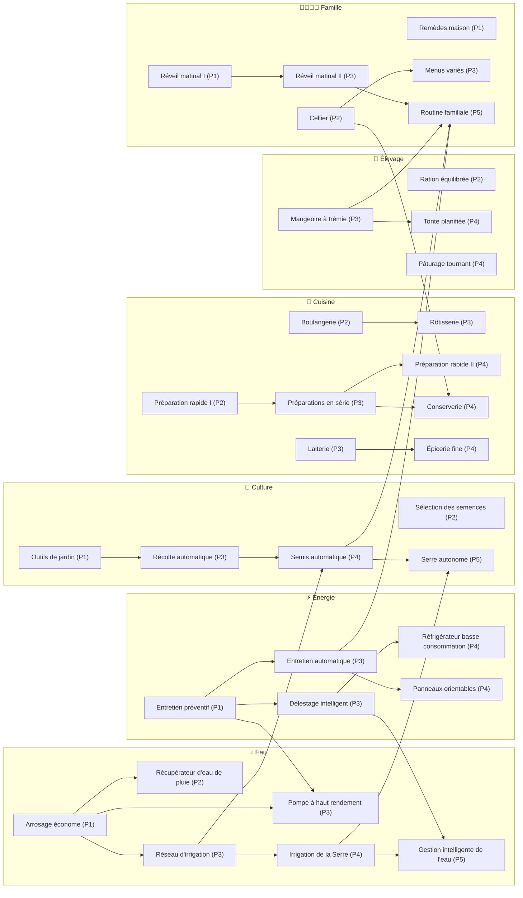

# Ferme Familiale — Arbre des technologies v2

> Proposition de conception, à intégrer à `docs/conception.md` (section 1.4, 8.3 et 8.7) une fois validée.
> Les données correspondantes sont dans `techtree_v2.js` (format `DATA.techtree`) ; les tableaux ci-dessous en sont générés.
> 🟡 = valeur provisoire, à caler avec `simulate.mjs`.

## 1. Décisions retenues

| # | Décision | Conséquence |
|---|---|---|
| 1 | Chapitres **et** arbre | Les chapitres donnent des **points de technologie (PT)**, ouvrent les **paliers** et continuent d'ouvrir les bâtiments principaux (`CHAPITRES.debloque` inchangé). L'arbre débloque les recettes secondaires, les petits équipements et tous les effets. |
| 2 | Automatisations dans l'arbre | Le niveau 5 du Potager, du Champ et du Poulailler ne donne plus que des parcelles ou de la place. `DATA.AUTOMATISATION` disparaît ; `isAutomated()` lit les nœuds. |
| 3 | Pas de « premium » | Aucun système de qualité. Les 4 recettes de luxe existantes (×3) restent, débloquées par un nœud. Aucun nœud de rendement alimentaire (l'autonomie progresse déjà plus vite que la courbe 8.10). |
| 4 | 6 branches actuelles | Énergie, Eau, Culture, Élevage, Cuisine, Famille. Les automatisations sont réparties dans les branches concernées. |

## 2. Règles du système

### 2.1 Coût d'un nœud

Chaque nœud coûte **des PT et des pièces**. Les PT limitent le **rythme** (on choisit ses priorités) ; les pièces rattachent l'arbre à l'économie de la ferme.

### 2.2 Sources de PT

| Source | PT |
|---|---|
| Chapitre terminé (1 → 7) | 2 · 3 · 3 · 4 · 4 · 5 · 5 = **26** |
| Jalons de maîtrise (une fois chacun) : 2 000 L pompés · 10 plats différents · 50 pains · 40 laines · 40 nuits jouées · 20 nuits à 100 % | 6 × 1 = **6** |
| Mode libre (campagne finie) : toutes les 5 nuits à 100 % 🟡 | +1, sans limite |

Les compteurs `litres`, `pains`, `plats`, `laines` existent déjà (`campagne.compteurs`) ; il faut ajouter `nuits100` (cumul, pas série) et lire `state.day` pour les nuits jouées. 🟡 Certains compteurs ne démarrent qu'avec le chapitre qui les porte : pour les jalons, il faut un cumul depuis le début de partie.

### 2.3 Paliers

Un nœud n'est achetable que si le **chapitre en cours** atteint celui de son palier (prérequis implicite, affiché comme les autres).

| Palier | Nom | Chapitre en cours | PT gagnés à l'ouverture | PT pour tout le palier et les précédents |
|---|---|---|---|---|
| 1 | Premiers pas | 1 | 0 | 5 |
| 2 | Organisation | 3 | 5 | 11 |
| 3 | Automatisation | 4 | 8 | 27 |
| 4 | Maîtrise | 5 | 12 | 42 |
| 5 | Autonomie | 7 | 21 | 51 |

**Budget** : 34 nœuds, **51 PT** et 19 450 💰 au total. La campagne rapporte 32 PT (chapitres + maîtrise) : le joueur en possède environ 60 % à la fin, **par choix**, et complète l'arbre en mode libre (≈ 95 nuits à 100 %).

**Chemins vérifiés** :
- Les trois anciennes automatisations du niveau 5 (arrosage, récolte, nourrissage) demandent 5 nœuds, **8 PT** et 2 650 💰 : exactement les PT disponibles à l'ouverture du palier 3 (chapitre 4) si le joueur a tout gardé, sinon au chapitre 5. Avant, elles arrivaient vers la nuit 60 (Potager niv. 5 à 1 000 💰).
- Toutes les automatisations : 9 nœuds, 17 PT.
- **Routine familiale** (fin de jeu) avec tous ses prérequis : 18 PT, atteignable au chapitre 7 (21 PT gagnés) pour un joueur qui s'y consacre.

### 2.4 Prérequis

Types acceptés (le moteur gère déjà les deux premiers, en ET) :

| Type | Forme | Exemple |
|---|---|---|
| Nœud | `{ noeud }` | Réseau d'irrigation |
| Niveau de bâtiment | `{ batiment, niveau }` | Pompe niv. 3 |
| Construit | `{ construit }` | Serre, Pâturage, Four, Réfrigérateur |
| Parc d'appareils | `{ appareil, nombre }` | 2 batteries |

### 2.5 Effets

Un seul agrégateur remplace `prepTimeMult()` et `awakeRequired()` : il parcourt les nœuds acquis et combine chaque clé selon sa règle.

| Clé | Combinaison | Utilisée par | Cumul maximal |
|---|---|---|---|
| `tempsPrepa`, `eauArrosage`, `usure`, `kwhParLitre`, `frigoConso`, `blePoule`, `soinCout` | produit | temps, eau, usure, pompe, frigo, poules, soins | ×0,64 · ×0,765 · ×0,75 · ×0,75 · ×0,7 · ×0,8 · ×0,7 |
| `eveilMin` | minimum | éveil minimal | 10 s |
| `conservation`, `grainesBonus`, `recuperation` | somme | péremption, graines, santé | +1 · +1 · +1 |
| `bonusPlatsMax`, `solaireHiver`, `croissanceSurface`, `fileAttente` | valeur du nœud | santé, saisons, pâturage, ateliers | 5 · 0,85 · 1,1 · 3 |
| `auto: { tâche: [lieux] }` | union | nuit (`autoTasks`) | arrosage, récolte, semis, nourrissage, tonte |
| `recettes` | union | Livre de recette | 16 recettes |
| `actionsGroupees`, `pluie`, `delestage`, `entretienAuto`, `arrosagePrioritaire`, `routine` | présence | fonctions dédiées | — |

Chaque levier reste à −36 % au plus (temps de préparation) et aucun n'augmente la **quantité de nourriture** récoltée.

## 3. Graphe des dépendances

Seules les dépendances entre nœuds sont tracées ; les prérequis de bâtiments sont dans les tableaux. Les liens entre branches : Eau → Culture (irrigation → semis), Énergie → Eau (entretien → pompe), Famille → Cuisine (cellier → conserverie), et quatre branches → Routine familiale.

## 4. Nœuds par branche

### ⚡ Énergie — 5 nœuds, 7 PT, 2 400 💰

| Palier | ID | Nœud | Fonction | Coût | Prérequis | Effet |
|---|---|---|---|---|---|---|
| 1 | `en_entretien` | 🔧 Entretien préventif | Productivité | 1 PT + 100 💰 | — | Panneaux, batteries et appareils s'usent 25 % moins vite. |
| 3 | `en_delestage` | 🎛️ Délestage intelligent | Automatisation | 1 PT + 400 💰 | Entretien préventif + 2 batteries | Sous 10 % de charge, le Moulin, la Presse et la Pompe se mettent en pause pour garder l'électricité du réfrigérateur. Ils repartent seuls quand la charge remonte. |
| 3 | `en_entretien_auto` | 🛠️ Entretien automatique | Automatisation | 2 PT + 500 💰 | Entretien préventif | Chaque nuit, les appareils à 70 % d'usure ou plus sont entretenus automatiquement, au prix normal, si les pièces suffisent. |
| 4 | `en_frigo_eco` | 🧊 Réfrigérateur basse consommation | Productivité | 1 PT + 600 💰 | Délestage intelligent + Réfrigérateur construit | Le réfrigérateur consomme 30 % d'électricité en moins. |
| 4 | `en_hiver` | ☀️ Panneaux orientables | Productivité | 2 PT + 800 💰 | Entretien automatique | En hiver, les panneaux produisent 85 % de leur puissance au lieu de 70 %. |

### 💧 Eau — 6 nœuds, 10 PT, 3 900 💰

| Palier | ID | Nœud | Fonction | Coût | Prérequis | Effet |
|---|---|---|---|---|---|---|
| 1 | `ea_econome` | 💧 Arrosage économe | Productivité | 1 PT + 150 💰 | Pompe niv. 2 | Chaque arrosage consomme 15 % d'eau en moins. |
| 2 | `ea_pluie` | 🌧️ Récupérateur d'eau de pluie | Déblocage | 1 PT + 250 💰 | Arrosage économe | Chaque nuit, de l'eau de pluie s'ajoute au réservoir sans électricité : 20 L au printemps et en automne, 10 L en hiver, 5 L en été. |
| 3 | `ea_irrigation` | 🚿 Réseau d'irrigation | Automatisation | 2 PT + 900 💰 | Arrosage économe + Pompe niv. 3 + Potager niv. 3 | Chaque nuit, toutes les parcelles plantées du Potager et du Champ sont arrosées automatiquement. |
| 3 | `ea_pompe_eco` | ⛲ Pompe à haut rendement | Productivité | 1 PT + 500 💰 | Arrosage économe + Entretien préventif | La pompe consomme 25 % d'électricité en moins par litre. |
| 4 | `ea_serre` | 🏡 Irrigation de la Serre | Automatisation | 2 PT + 600 💰 | Réseau d'irrigation + Serre construit | Chaque nuit, les parcelles plantées de la Serre sont arrosées automatiquement. |
| 5 | `ea_gestion` | 📟 Gestion intelligente de l'eau | Automatisation | 3 PT + 1 500 💰 | Irrigation de la Serre + Délestage intelligent | Quand l'eau manque, l'arrosage automatique sert d'abord les plantes les plus proches de la récolte. Chaque arrosage consomme encore 10 % d'eau en moins. |

### 🌱 Culture — 5 nœuds, 9 PT, 3 900 💰

| Palier | ID | Nœud | Fonction | Coût | Prérequis | Effet |
|---|---|---|---|---|---|---|
| 1 | `cu_outils` | 🧰 Outils de jardin | Temps | 1 PT + 100 💰 | — | Ajoute « Arroser tout » et « Récolter tout » au Potager, au Champ et à la Serre. |
| 2 | `cu_semences` | 🌰 Sélection des semences | Productivité | 1 PT + 200 💰 | — | Les cultures qui rendent des graines en donnent une de plus, et une carotte montée en graine en donne 8 au lieu de 6. |
| 3 | `cu_recolte_auto` | 🧺 Récolte automatique | Automatisation | 2 PT + 900 💰 | Outils de jardin + Potager niv. 4 | Chaque nuit, les parcelles mûres du Potager et du Champ sont récoltées automatiquement (celles montées en graine comprises, graines à la clé). |
| 4 | `semis_auto` | 🌾 Semis automatique | Automatisation | 2 PT + 1 200 💰 | Récolte automatique + Réseau d'irrigation | Après une récolte automatique, la parcelle est replantée avec la même culture si une graine est disponible au-delà de la réserve de semences. Réglable parcelle par parcelle. Pour que les carottes, qui ne rendent pas de graines, ne manquent jamais de semences, le jeu laisse monter en graine le nombre de carottes mûres nécessaire pour couvrir toutes les parcelles à replanter ; une parcelle qui n'a pas sa graine attend, mûre. |
| 5 | `cu_serre_auto` | 🌿 Serre autonome | Automatisation | 3 PT + 1 500 💰 | Semis automatique + Irrigation de la Serre | La Serre est récoltée et replantée automatiquement chaque nuit, avec les mêmes réglages que le semis automatique. |

### 🐔 Élevage — 4 nœuds, 6 PT, 1 700 💰

| Palier | ID | Nœud | Fonction | Coût | Prérequis | Effet |
|---|---|---|---|---|---|---|
| 2 | `el_ration` | 🌾 Ration équilibrée | Productivité | 1 PT + 200 💰 | Poulailler construit | Une poule mange 0,4 blé par nuit au lieu de 0,5. |
| 3 | `el_mangeoire` | 🪣 Mangeoire à trémie | Automatisation | 2 PT + 600 💰 | Poulailler niv. 3 + Silo niv. 2 | Chaque nuit, les poules sont nourries automatiquement avec le blé du Silo. |
| 4 | `el_tonte` | ✂️ Tonte planifiée | Automatisation | 2 PT + 500 💰 | Mangeoire à trémie + Pâturage construit | Chaque nuit, les moutons dont la laine est prête sont tondus automatiquement. |
| 4 | `el_paturage` | 🐑 Pâturage tournant | Productivité | 1 PT + 400 💰 | Pâturage construit | Le prix de chaque parcelle de pâturage supplémentaire augmente de 10 % au lieu de 20 %. |

### 🍳 Cuisine — 8 nœuds, 11 PT, 3 700 💰

| Palier | ID | Nœud | Fonction | Coût | Prérequis | Effet |
|---|---|---|---|---|---|---|
| 2 | `prepa_1` | ⏱️ Préparation rapide I | Temps | 1 PT + 300 💰 | — | Les temps de préparation (Four, Cuisine, Moulin, Presse) baissent de 20 %. |
| 2 | `cui_boulangerie` | 🥖 Boulangerie | Déblocage | 1 PT + 200 💰 | Four construit | Nouvelles recettes au Four : pain à l'ail, tarte aux fraises, quiche aux épinards. |
| 3 | `cui_serie` | 📋 Préparations en série | Automatisation | 2 PT + 500 💰 | Préparation rapide I | Chaque atelier accepte jusqu'à 3 préparations à la suite : elles s'enchaînent sans clic, ingrédients réservés au lancement. |
| 3 | `cui_laiterie` | 🧀 Laiterie | Déblocage | 1 PT + 300 💰 | Pâturage construit | Nouvelles recettes en Cuisine : fromage frais, riz au lait. |
| 3 | `cui_rotisserie` | 🍗 Rôtisserie | Déblocage | 1 PT + 300 💰 | Boulangerie + Pâturage construit | Nouvelles recettes au Four : rôti de bœuf, poulet rôti à l'ail, poivrons farcis. |
| 4 | `prepa_2` | ⏱️ Préparation rapide II | Temps | 1 PT + 700 💰 | Préparations en série | Encore −20 % sur les temps de préparation (×0,64 en tout). |
| 4 | `cui_conserverie` | 🫙 Conserverie | Déblocage | 2 PT + 600 💰 | Préparations en série + Cellier | Nouvelles recettes en Cuisine : bocal de légumes (4 légumes d'une même sorte, ne périme pas) et confiture de fraises. |
| 4 | `cui_epicerie` | ☕ Épicerie fine | Déblocage | 2 PT + 800 💰 | Laiterie + Serre construit | Recettes de luxe en Cuisine : chocolat chaud, café, crème à la vanille, bière artisanale. |

### 👨‍👩‍👧‍👦 Famille — 6 nœuds, 8 PT, 3 850 💰

| Palier | ID | Nœud | Fonction | Coût | Prérequis | Effet |
|---|---|---|---|---|---|---|
| 1 | `reveil_1` | 🌅 Réveil matinal I | Temps | 1 PT + 200 💰 | — | L'éveil minimal avant de pouvoir dormir passe de 30 s à 20 s. |
| 1 | `fa_remedes` | 🌿 Remèdes maison | Productivité | 1 PT + 100 💰 | — | Les soins coûtent 30 % de moins, et un malade regagne 3 points de santé par nuit bien nourrie au lieu de 2. |
| 2 | `fa_cellier` | 🏚️ Cellier | Productivité | 1 PT + 250 💰 | — | Hors réfrigérateur, tout ce qui périme se garde une nuit de plus. |
| 3 | `fa_menus` | 🍽️ Menus variés | Productivité | 1 PT + 300 💰 | Cellier | Le bonus de santé des plats différents mangés monte jusqu'à +5 par nuit au lieu de +3. |
| 3 | `reveil_2` | 🌅 Réveil matinal II | Temps | 1 PT + 500 💰 | Réveil matinal I | L'éveil minimal passe à 10 s. |
| 5 | `fa_routine` | 🏡 Routine familiale | Automatisation | 3 PT + 2 500 💰 | Réveil matinal II + Semis automatique + Mangeoire à trémie + Entretien automatique | Option « Dormir tout seul » : jeu ouvert, la famille va se coucher d'elle-même dès que l'éveil minimal est écoulé. |

## 5. Recettes

**Toujours disponibles** dès que l'atelier est construit (11) : pain, gratin de patates, tarte aux pommes (Four) ; omelette, ratatouille, ragoût, compote, soupe de légumes, salade de tomates (Cuisine) ; farine (Moulin) ; huile (Presse).

La soupe et la salade restent libres volontairement : l'objectif du chapitre 4 (« 3 plats différents hors pain ») doit rester faisable sans l'arbre. Avec les seules recettes d'origine, seuls gratin, omelette et ratatouille sont réalisables à ce stade (ragoût, compote et tarte demandent le chapitre 5 ou 6).

**Débloquées par l'arbre** (16) :

| Nœud | Recettes |
|---|---|
| 🥖 Boulangerie | pain à l'ail, tarte aux fraises, quiche aux épinards |
| 🧀 Laiterie | fromage frais, riz au lait |
| 🍗 Rôtisserie | rôti de bœuf, poulet rôti à l'ail, poivrons farcis |
| 🫙 Conserverie | **bocal de légumes** (nouveau), confiture de fraises |
| ☕ Épicerie fine | chocolat chaud, café, crème à la vanille, bière artisanale |

Dans le Livre de recette, une recette verrouillée reste visible, grisée, avec le nom du nœud qui l'ouvre.

## 6. Nouveaux contenus introduits

| Élément | Règle | Valeurs 🟡 |
|---|---|---|
| **Bocal de légumes** | Cuisine, 4 légumes d'une même sorte + 1 L d'eau → 1 bocal. Ne périme pas. Nouvel item distinct de `conserve` : il compte comme **produit** pour l'autonomie (la conserve de départ reste « achetée »). | 30 s · 40 énergie · prix par la formule des plats |
| **Eau de pluie** | Étape de nuit, avant l'arrosage automatique : ajoute des litres au réservoir, plafonnés à sa capacité, sans électricité. | 20 / 5 / 20 / 10 L selon la saison |
| **Actions groupées** | « Arroser tout » et « Récolter tout » par zone, au clic : une tentative par parcelle, avec la productivité de la santé comme pour les clics. | — |
| **File de préparations** | Chaque atelier garde jusqu'à 3 préparations en attente ; les ingrédients sont retirés au moment de la mise en file ; annuler rend les ingrédients. Le hors-ligne fait avancer la file comme une préparation. | 3 places |
| **Délestage** | Sous le seuil de charge totale des batteries, le Moulin, la Presse et la Pompe sont suspendus (pas éteints : ils reprennent seuls). | 10 % |
| **Entretien automatique** | Au Dormir, chaque appareil à `SERVICE_THRESHOLD` (70 %) ou plus est entretenu si les pièces suffisent, dans l'ordre du parc ; résumé dans le rapport du réveil. | — |
| **Arrosage prioritaire** | Quand l'eau ne suffit pas, l'arrosage automatique trie les parcelles par stades restants (croissant). | — |
| **Routine familiale** | Réglage « Dormir tout seul » (désactivé par défaut) : jeu ouvert et onglet visible, `sleep()` est appelé dès que l'éveil minimal est écoulé. **Le hors-ligne ne fait toujours passer aucune nuit.** | — |

## 7. Ordre des étapes de la nuit

Repas → **pluie** → récolte automatique → semis automatique → arrosage automatique (prioritaire si acquis) → nourrissage → **tonte** → **entretien automatique** → pousse, ponte, croissance, péremption (inchangés).

## 8. Migration de sauvegarde (v12 → v13)

1. `state.pointsTech = { solde, gagnes, maitrise: [] }`. Le solde de départ = PT des chapitres déjà terminés ; les jalons de maîtrise se valident au premier tick.
2. Les nœuds déjà possédés (`semis_auto`, `prepa_*`, `reveil_*`) sont conservés **sans rien déduire**.
3. **Pas de perte d'acquis** : on offre gratuitement les nœuds qui correspondent à ce que la partie savait déjà faire. Les automatisations sont offertes avec leurs prérequis de type nœud ; les nœuds de recettes sont offerts seuls :
   - Potager ≥ 5 → Outils de jardin, Arrosage économe, Réseau d'irrigation, Récolte automatique ;
   - Champ ≥ 5 → les mêmes (les automatisations valent maintenant pour les deux zones) ;
   - Poulailler ≥ 5 → Mangeoire à trémie ;
   - Four construit → Boulangerie ; Pâturage construit → Laiterie et Rôtisserie ; Cuisine construite → Conserverie (pour la confiture) ; Serre construite → Épicerie fine.
4. Un nœud offert ne consomme pas de PT : le joueur garde ses points pour la suite.
5. Les identifiants inconnus restent ignorés (`ownedTechs()` inchangé).

## 9. Impacts sur le code

| Zone de `jeu.html` | Changement |
|---|---|
| `DATA.techtree` | Remplacé par `techtree_v2.js` ; `DATA.AUTOMATISATION` supprimé |
| Moteur, arbre | Agrégateur d'effets ; `techPrereqs()` gère `construit`, `appareil` et le palier ; `buyTech()` débite PT + pièces ; gain de PT dans `completeChapter()` et au réveil (maîtrise, mode libre) |
| Moteur, ferme | `isAutomated()` et `autoTasks()` par tâche et par lieu (Serre et tonte ajoutées) ; eau, pompe, usure, frigo, blé, soins, conservation, graines lisent l'agrégateur ; pluie, délestage, entretien auto, file de préparations, bocal |
| Interface | En-tête de l'onglet : solde de PT ; palier sur chaque carte ; recettes verrouillées dans le Livre ; boutons groupés ; file des ateliers ; réglage Routine dans ⚙️ Options |
| Chapitres | Écran de fin de chapitre : « +N points de technologie » ; libellé du chapitre 7 à revoir (« Automatisations avancées » n'est plus un déblocage de chapitre) |
| Tests | Test « DATA Lot 7 » (liste des nœuds, coûts) à réécrire ; test du mode test niveau 5 → automatisations ; nouveaux tests : paliers, PT, agrégateur, migration v13, nuit |
| Simulation | `DATA.SIMULATION.PLAN` : acheter les nœuds d'automatisation au lieu de viser le niveau 5 ; recalibrer les jalons 8.10 |
| Mode test | « Débloquer tous les nœuds » offre aussi les PT ; bouton « +10 PT » |
| Encyclopédie | Ajouter les nœuds et le bocal à `encyclopedie_ferme_familiale.json` |

Ordre de livraison conseillé : (1) données + agrégateur + PT + migration, sans nouveau contenu ; (2) automatisations déplacées ; (3) recettes verrouillées ; (4) nouveaux contenus (pluie, groupés, file, délestage, entretien, bocal) ; (5) Routine familiale ; (6) simulation et équilibrage.

## 10. Décisions ouvertes 🟡

- **Coûts en pièces** : posés à l'estime (19 450 💰 au total) ; à valider avec `simulate.mjs`, surtout le palier 3 (5 700 💰) qui arrive en même temps que le Four et les ateliers.
- **Automatisation plus précoce** : elle peut arriver dès le chapitre 4 au lieu de la nuit 60 environ. Elle n'augmente pas la production, mais elle évite les oublis ; à surveiller sur la courbe d'autonomie.
- **Niveau 5 moins attractif** : sans l'automatisation, Potager niv. 5 (1 000 💰) ou Poulailler niv. 5 (900 💰) ne donnent plus que de la place. Baisser ces coûts, ou accepter.
- **Rythme du mode libre** : 1 PT toutes les 5 nuits à 100 %.
- **Bocal de légumes** : 40 énergie pour 4 légumes (de 20 avec l'épinard à 76 avec la patate) ; forfait simple, mais défavorable avec la patate.
- **Routine familiale** : la laisser seulement jeu ouvert (proposition), ou accepter quelques nuits hors ligne une fois tout automatisé.
